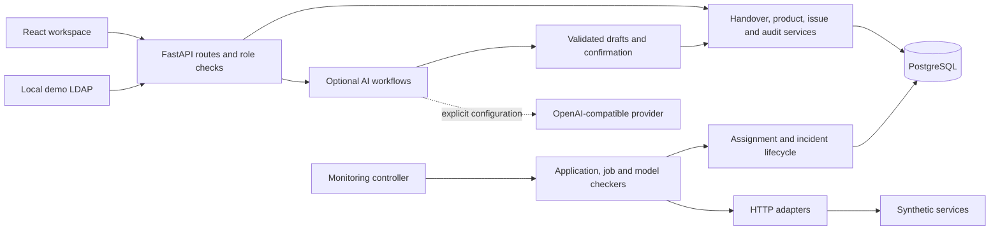

# Architecture

The API handles authentication and request schemas; service functions own workflow changes and database transactions. The monitoring controller runs checkers on a timer. Adapters translate HTTP responses into normalized signals so incident policy does not depend on a vendor's wire format.

SQLAlchemy models capture project/product ownership, handover versions, jobs, applications, issues, schedules, and audit records. PostgreSQL is the public demo database. Unit and behavioral tests use isolated SQLite fixtures where appropriate; those tests do not prove PostgreSQL deployment behavior.

The assistant has explicit read tools, document extraction, retrieval, and write proposals. Operations that change platform state pass through proposal validation and user confirmation. Deterministic workflows stay available when a model is unconfigured.

The model monitor uses `GET /api/projects`, `GET /api/projects/{id}`, and normalized per-model `signals`. See `mock_services/model_monitor.py`. CML-style job/application examples use local mock integrations.

## Tradeoffs

- The frontend remains a substantial single-page workspace. Its main module and production bundle are large; route-level splitting is a future improvement.
- Schema creation and legacy backfills run at startup. Production use would require a reviewed migration strategy.
- The default deployment is a local demonstration with public credentials and mock infrastructure. Production identity, deployment, scaling, and operations are outside this release's scope.
